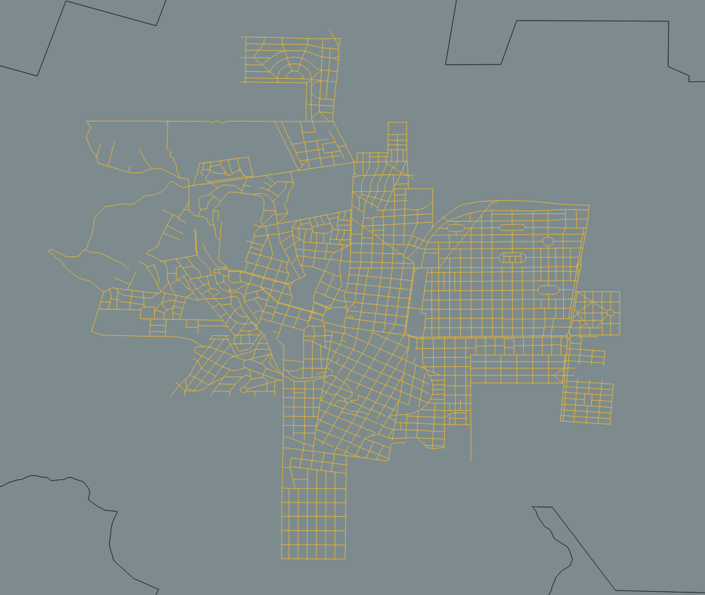
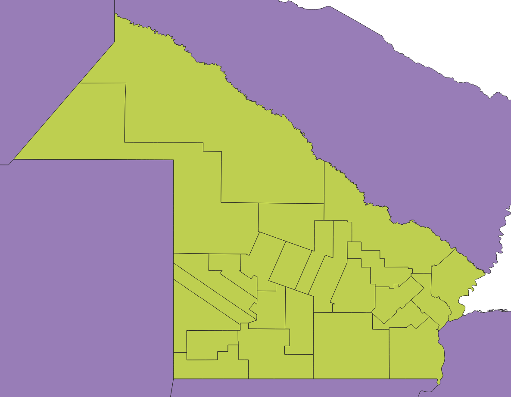

# Descarga de Geometrías

La API permite la descarga de geometrías a través del formato [ESRI Shapefile](https://es.wikipedia.org/wiki/Shapefile). Para utilizar el formato, se debe agregar `formato=shp` a la lista de parámetros especificados en la URL. El formato Shapefile está disponible en los siguientes recursos (versión GET):

- `/provincias`
- `/departamentos`
- `/municipios`
- `/localidades`
- `/calles`

Cuando se especifica `formato=shp`, la respuesta de la API es un archivo ZIP que contiene los tres archivos requeridos por el estándar: `.shp`, `.shx` y `.dbf`. El archivo luego puede ser abierto con programas como [QGIS](https://www.qgis.org/en/site/). El sistema de coordenadas de las geometrías descargadas es WGS84 (EPSG 4326).

Por ejemplo, si se desea obtener todas las calles del municipio Alta García (ID 141372), se puede utilizar la siguiente consulta:

`GET` [https://apis.datos.gob.ar/georef/api/calles?interseccion=municipio:141372&formato=shp&max=1000](https://apis.datos.gob.ar/georef/api/calles?interseccion=municipio:141372&formato=shp&max=1000)

Que descargaría los siguientes datos:

 

Si se desean descargar todos los departamentos de la provicina de Chaco, se puede utilizar la siguiente consulta:

`GET` [https://apis.datos.gob.ar/georef/api/departamentos?provincia=chaco&formato=shp&max=1000](https://apis.datos.gob.ar/georef/api/departamentos?provincia=chaco&formato=shp&max=1000)

Que descargaría los siguientes datos:

